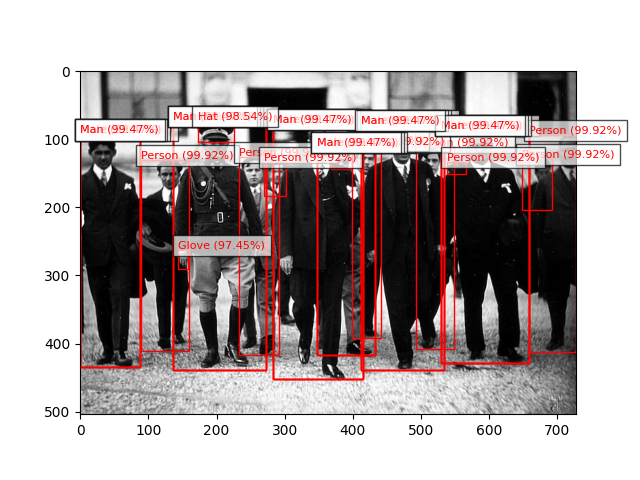

# Image Label Generator Using Amazon Rekognition

This project demonstrates an image label generator that leverages Amazon Rekognition and Python to automatically extract labels from images stored in Amazon S3 buckets. The infrastructure is provisioned using Terraform to ensure efficient and reproducible deployment.

## Table of Contents

- [Introduction](#introduction)
- [Architecture Diagram](#architecture-diagram)
- [Setup and Deployment](#setup-and-deployment)
  - [Prerequisites](#prerequisites)
  - [Terraform Configuration](#terraform-configuration)
  - [Python Script](#python-script)
- [Usage](#usage)

## Introduction

The Image Label Generator project utilizes Amazon Rekognition to analyze images stored in an S3 bucket and extract descriptive labels with confidence scores. This project demonstrates cloud-native development practices by integrating several AWS services and automating the infrastructure setup using Terraform.

## Architecture Diagram


## Setup and Deployment

### Prerequisites

- An AWS account with appropriate permissions to create S3 buckets, IAM roles, and use Rekognition.
- Terraform installed on your local machine.
- Python installed on your local machine with the `boto3` library.

### Terraform Configuration

1. **Initialize Terraform**: Download and install Terraform from the official website if you haven't already.
2. **Configure AWS Provider**: Create a `main.tf` file and add the following code to configure the AWS provider and resources.

```hcl
provider "aws" {
  region = "your_aws_region"
}

resource "aws_s3_bucket" "image_bucket" {
  bucket = "your_bucket_name"
}

resource "aws_iam_role" "rekognition_role" {
  name = "rekognition_role"

  assume_role_policy = jsonencode({
    "Version" : "2012-10-17",
    "Statement" : [
      {
        "Effect" : "Allow",
        "Principal" : {
          "Service" : "rekognition.amazonaws.com"
        },
        "Action" : "sts:AssumeRole"
      }
    ]
  })
}

resource "aws_iam_policy_attachment" "rekognition_policy_attachment" {
  name       = "rekognition_policy_attachment"
  policy_arn = "arn:aws:iam::aws:policy/AmazonRekognitionReadOnlyAccess"
  roles      = [aws_iam_role.rekognition_role.name]
}
```

3. Deploy Resources

- Initialize Terraform: terraform init
- Review configuration: terraform plan
- Apply configuration: terraform apply

## Python Script

1. Install boto3:
   pip install boto3

2. Create Python Script: Create a Python script (detect_labels.py) to interact with Amazon Rekognition.

def detect_labels(photo, bucket): # Create a Rekognition client
client = boto3.client('rekognition')

    # Detect labels in the photo
    response = client.detect_labels(
        Image={'S3Object': {'Bucket': bucket, 'Name': photo}},
        MaxLabels=10)

    # Print detected labels
    print('Detected labels for ' + photo)
    print()
    for label in response['Labels']:
        print("Label:", label['Name'])
        print("Confidence:", label['Confidence'])
        print()

    # Load the image from S3
    s3 = boto3.resource('s3')
    obj = s3.Object(bucket, photo)
    img_data = obj.get()['Body'].read()
    img = Image.open(BytesIO(img_data))

    # Display the image with bounding boxes
    plt.imshow(img)
    ax = plt.gca()
    for label in response['Labels']:
        for instance in label.get('Instances', []):
            bbox = instance['BoundingBox']
            left = bbox['Left'] * img.width
            top = bbox['Top'] * img.height
            width = bbox['Width'] * img.width
            height = bbox['Height'] * img.height
            rect = patches.Rectangle((left, top), width, height, linewidth=1, edgecolor='r', facecolor='none')
            ax.add_patch(rect)
            label_text = label['Name'] + ' (' + str(round(label['Confidence'], 2)) + '%)'
            plt.text(left, top - 2, label_text, color='r', fontsize=8, bbox=dict(facecolor='white', alpha=0.7))
    plt.show()

    return len(response['Labels'])

    def main():
    photo = 'image.jpeg'
    bucket = 'your-bucket-name'
    label_count = detect_labels(photo, bucket)
    print("Labels detected:", label_count)

    if **name** == "**main**":
    main()

## Usage

1. Upload Images: Upload images to your S3 bucket.
2. Run Python Script: Execute the Python script to detect labels in the uploaded images.

## Results


